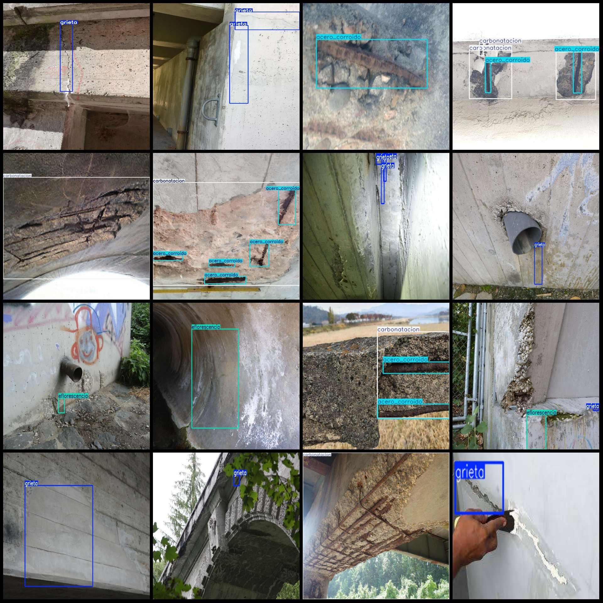
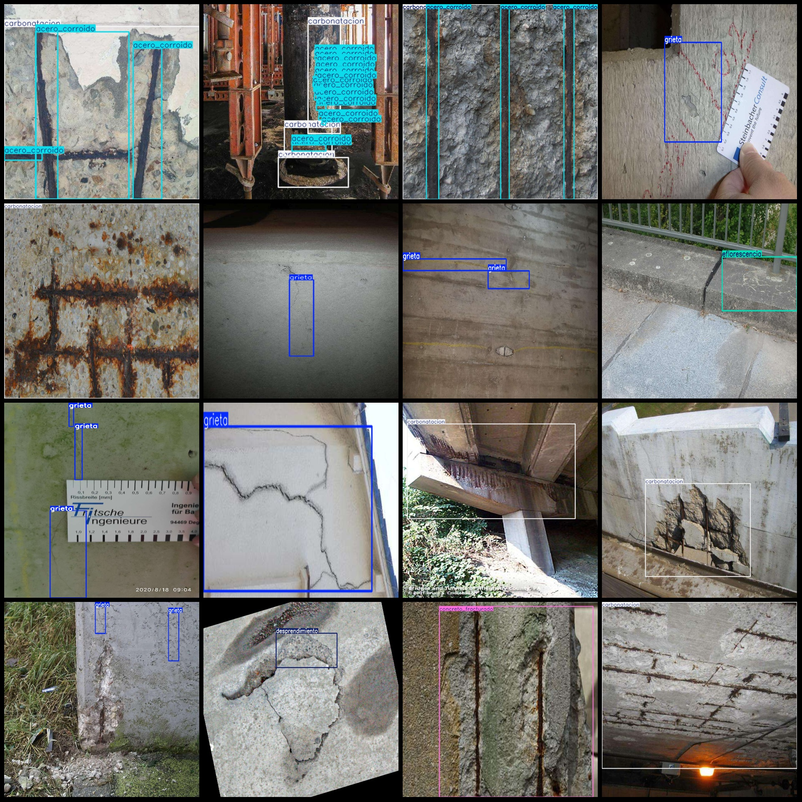

# Cracks, Scale-off, Carbonation Defect Identification and Detection Dataset in the VOC+YOLO format with 5275 images across 10 categories

The dataset is in Pascal VOC format + YOLO format. The txt files contain only the images and corresponding VOC format xml files, while the yolo format txt files contain only the labels. The number of images (jpg files), labeled files (xml files), and labeled files (txt files) are as follows:
- Image count: 5275
- Labeled file count: 5275
- Labeled file count: 5275
- Labeled category count: 10
- Labeled category names: ["acero_corroido", "cangrejera", "carbonatacion", "concreto_erosionado", "concreto_fracturado", "concreto_pobre", "desprendimiento", "eflorescencia", "fisura", "grieta"]
- Box counts for each category:
- acero_corroido = 4057
- cangrejera = 20
- carbonatacion = 2976
- concrete_erosionado = 15
- concrete_fracturado = 487
- concrete_pobre = 11
- desprendimiento = 811
- eflorscencia = 466
fisura box count = 40
Grieta (cracks) Frame Count = 4396
total boxes: 13279  
Image resolution: Multi-resolution images, such as 1024x682, 1280x960, etc.
Using annotation tool: labelImg
Annotation rules: Drawing a rectangle around the class
Important notes: None
Special statement: This dataset does not guarantee the accuracy of the trained models or weight files.
Image preview:
## Images

Here is a pay link on Stripe ( https://buy.stripe.com/3cs8yP7sY87d0vu9AB ). Please contact me lonlonago@foxmail.com after funding $89, and I will send you a complete data files , thank you!

